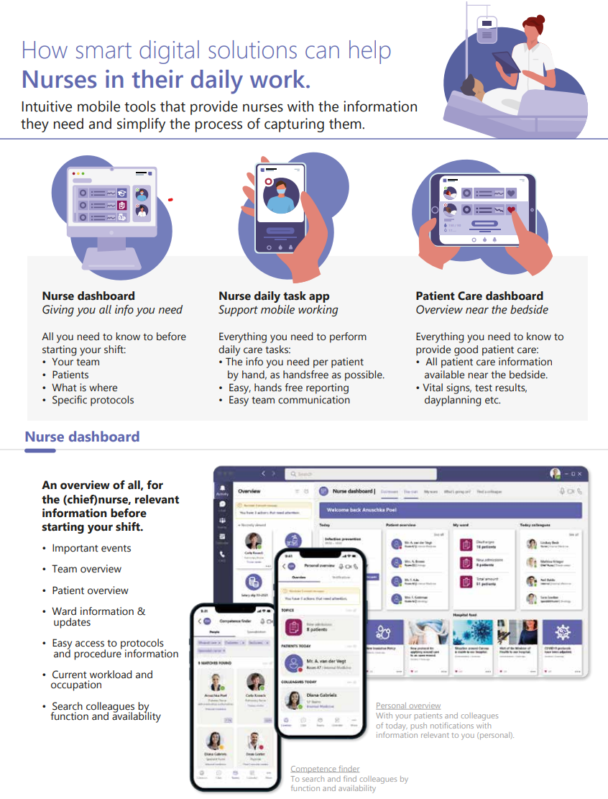
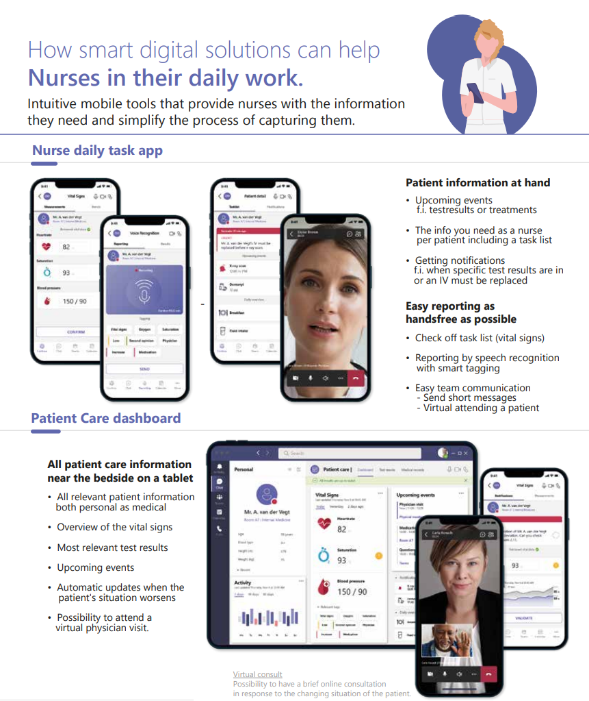
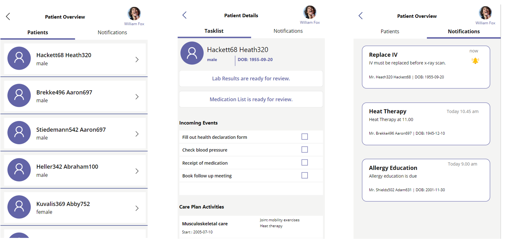
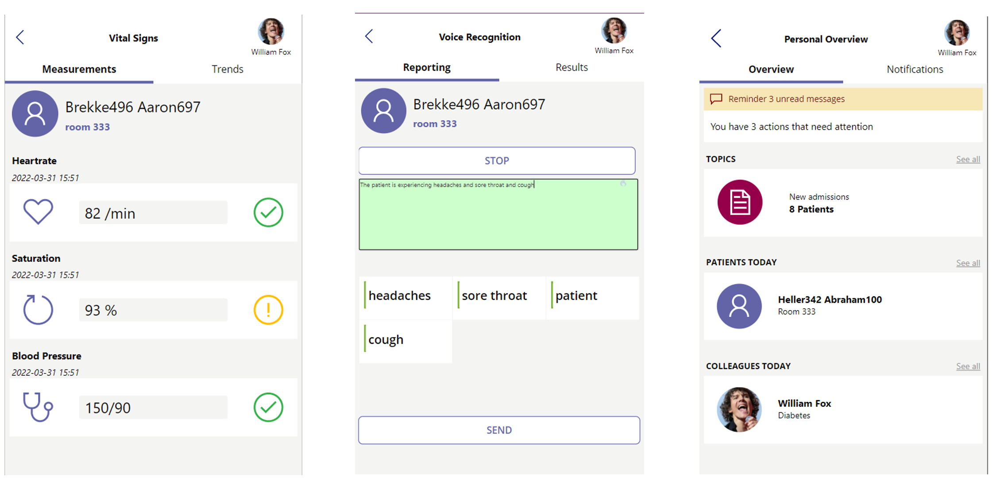
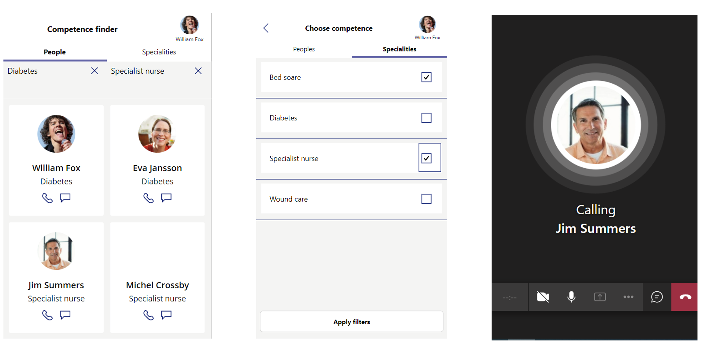
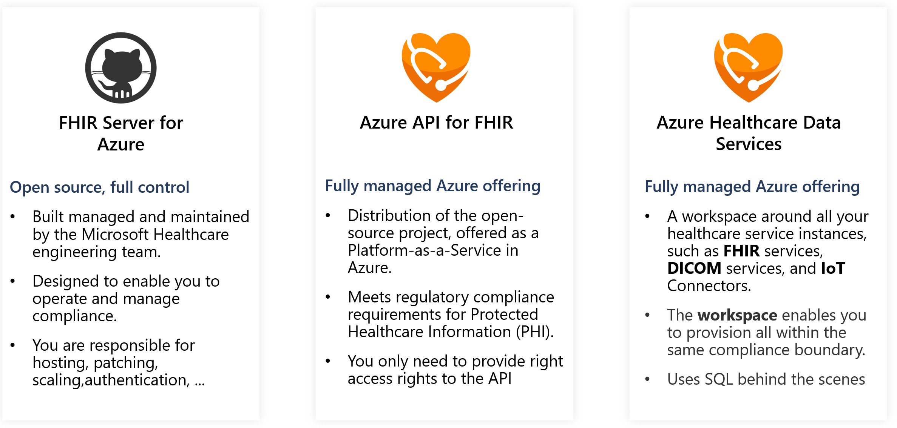

# Day in the life of a nurse

This repository contains three [Power Apps](https://make.powerapps.com/) which were created based on a study called 'The Day in the Life of a Nurse', one of the outcomes were several minimal viable products that could support nurses in their daily job. These MVP Power Apps solutions are enhanced with [Nuance Speech to Text](https://www.nuancehealthcaredeveloper.com/?q=Dragon-Medical-SpeechKit-Home), and utilize [Text Analytics for Health](https://docs.microsoft.com/en-us/azure/cognitive-services/language-service/text-analytics-for-health/overview ) for medical structuring. The data is being served from [FHIR API](https://docs.microsoft.com/en-us/azure/healthcare-apis/healthcare-apis-overview) and utilize the [FHIRBase](https://docs.microsoft.com/en-us/connectors/fhirbase/) and [FHIRClinical](https://docs.microsoft.com/en-us/connectors/fhirclinical/) Power Platform connectors.

# Scenario

The scenarios were created based on nurse interviews from several hospitals and countries in Western Europe, you can find the full white paper [here](whitepaper/Smart%20digital%20solutions%20to%20support%20nurses.pdf) 

  

 

# Inlcuded applications

## App One: Your patient information at hand

You can find the link to the package [here](packages/App%20One/)

## App Two: Easy Reporting at the bedside

You can find the link to the package [here](packages/App%20Two/)
## App Three: Efficient team communication

You can find the link to the package [here](packages/App%20Three/)
## Dependencies 

### FHIR API
The information being visualized in the Nurse applications is being served from a FHIR API. 

You can use the Open Source Microsoft FHIR Server: https://github.com/microsoft/fhir-server or use the managed Health Data Services on Azure: 
https://docs.microsoft.com/en-us/azure/healthcare-apis/healthcare-apis-overview

### Nuance Dragon Medical SpeechKit

To enable clinical speech to text, we embeded the Dragon Medical SpeechKit into the PowerApp, you can find more info on DMSK here: https://www.nuancehealthcaredeveloper.com/?q=Dragon-Medical-SpeechKit-Home, you can request a trial to see how the integration works

### Text Analytics For Health

To provide to automatic healthcare entity recognition, we utilized Text Analytics For Health: https://docs.microsoft.com/en-us/azure/cognitive-services/language-service/text-analytics-for-health/overview 

 

# Contributing
This project welcomes contributions and suggestions. Most contributions require you to agree to a Contributor License Agreement (CLA) declaring that you have the right to, and actually do, grant us the rights to use your contribution. For details, visit https://cla.opensource.microsoft.com.

When you submit a pull request, a CLA bot will automatically determine whether you need to provide a CLA and decorate the PR appropriately (e.g., status check, comment). Simply follow the instructions provided by the bot. You will only need to do this once across all repos using our CLA.

This project has adopted the Microsoft Open Source Code of Conduct. For more information see the Code of Conduct FAQ or contact opencode@microsoft.com with any additional questions or comments.
  

# Trademarks
This project may contain trademarks or logos for projects, products, or services. Authorized use of Microsoft trademarks or logos is subject to and must follow Microsoft's Trademark & Brand Guidelines. Use of Microsoft trademarks or logos in modified versions of this project must not cause confusion or imply Microsoft sponsorship. Any use of third-party trademarks or logos are subject to those third-party's policies.