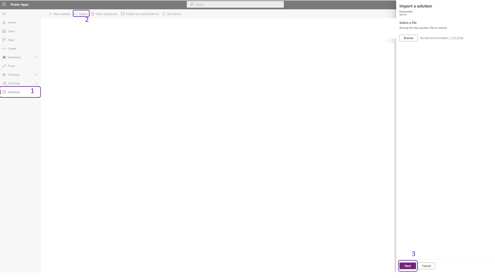
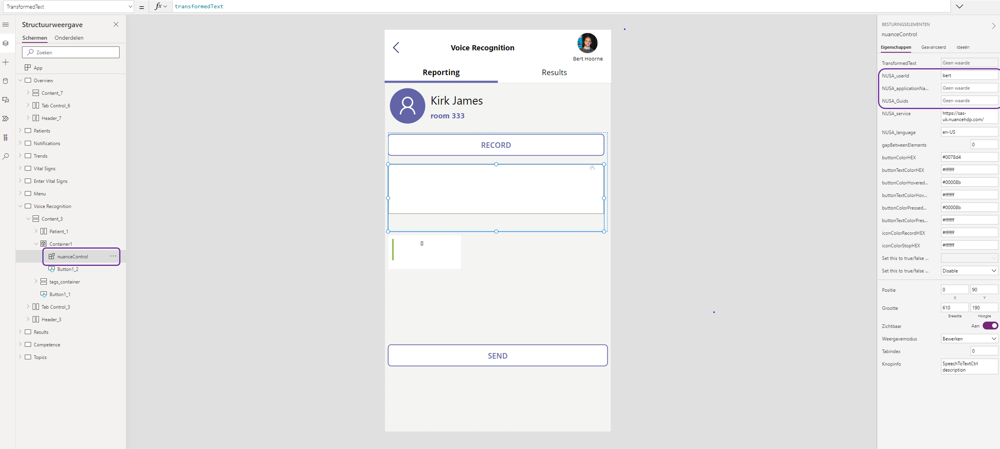

# Getting Started

## Import solution

The three different solutions can be found [here](Solutions/), download the zip files and navigate to https://make.powerapps.com/.  
You can then import a new solution by clicking on **solutions** , **import** and upload the **Solution Zip File**

 

# Connect to (and populate) your FHIR server to the Applications

The data from the applications are being served from a FHIR Server. You can easily deploy a managed FHIR server on Azure via the [Azure portal](https://docs.microsoft.com/en-us/azure/healthcare-apis/healthcare-apis-quickstart) or you can deploy the [open-source](https://github.com/microsoft/fhir-server) FHIR version. 

If you want to load dummy data into the FHIR server, you can use [Synthea](https://github.com/synthetichealth/synthea) to generate synthetic patient information. Where you then can import this data into your FHIR server via the open-source [FHIR loader](https://github.com/microsoft/fhir-loader)

 

# Nurse Reporting Application 

## Text Analytics  for Health Power Automate Flow ##

The **nurse reporting** app contains a Power Automate Flow that sends the transcribed conversation to an Azure Function, which communicates with the Text Analytics for Health endpoint. The code base can be found [here](./TextAnalyticsForHealthFunction/). You can easily deploy the azure function via this [tutorial](https://docs.microsoft.com/en-us/azure/azure-functions/functions-develop-vs-code). The only code change you need to make is in the TextAnalyticsWorker.cs file, by changing the <b>subscriptionKey</b> or <b>endpoint</b>.

## Nuance PCF Component

To enable PCF components in your canvas application, you may need to activate this in your environment. More info can be found [here](https://docs.microsoft.com/en-us/power-apps/developer/component-framework/component-framework-for-canvas-apps).
 
To activate the Nuance PCF component, you will need to provide some input to make the connection to the Nuance platform. If you open the app and go to the **Voice Recognition** screen, and select the **nuanceControl** you need to enter the **userId**, **applicationName** and **Guids** , to receive the GUIDS you can request a trial on the Nuance website here: https://www.nuancehealthcaredeveloper.com/?q=Dragon-Medical-SpeechKit-Home 

The source code of the PCF component is also on [Github](https://github.com/iBoonz/nuance-pcf-component), feel free to enhance, modify or change in anyway you like.

 

# Nurse Communication

Currently the clinicians and roles are defined in the *onstart* method on the App. This can be linked to your employee backend combined with the specialities they have.  